# Progress report — Adaptive XRF pipeline (SLAC SSRL)

**Updated:** 2026-06-08 (v2)
**Project:** Adaptive XRF imaging — Phase 1
**Supervision:** Sam Webb (SSRL / SLAC)

> **What changed since v1 (2026-06-01).** Three things matured the analysis:
> 1. The production script is now an **iterative multi-resolution cascade** (acquire → analyse → plan next level → repeat), not a single shot.
> 2. The quality metric moved from a `signal × dwell` proxy ("info ratio") to a **proper Poisson reconstruction MSE** (analytic + Monte-Carlo). This *reverses* an earlier conclusion: the MSE-optimal dwell is **`sqrt` (t ∝ √signal)**, and a naïve **binary** allocation actually *hurts* MSE.
> 3. A per-element analysis shows the **composite is dense but individual elements are sparse** — which is where adaptive scanning actually pays off.

---

## 0. Executive summary (for a first read)

- **Spatial speedup needs a sparse target.** On the **composite** (all elements summed) our samples are **dense** (75–82 % of the area occupied) → a plain fine raster is competitive; spatial skipping can't win. This is a physical ceiling, confirmed across the whole dataset.
- **But XRF imaging targets specific elements, and per element the signal is sparse** (~10–15 % of pixels are "hot", 50–100 % concentration; e.g. S, P, Al, Ti). **That is the regime where adaptive scanning pays off.** The pipeline must target a single element's ROIs, not the composite — this is the main next step.
- **At equal scan time, optimal temporal dwell improves image quality.** The MSE-optimal allocation is **t ∝ √signal** (`sqrt`); on UA1 it is the only strategy that beats a uniform raster (MSE ratio **1.10×**). This is the paper-2-style "same time, better image" result, and it works even on dense samples.
- **Engineering:** single-source utility modules, a descriptor-based recommender, a Poisson-MSE quality metric, and a **39-test** suite.

**Open questions for Sam are collected in §10. Result figures are in §12.**

---

## 1. Context and objective

In XRF imaging at a synchrotron, we scan a sample by measuring the fluorescence
spectrum at every pixel with a focused beam. A classical **raster** scan visits
every pixel with a fixed dwell time (e.g. 1 cm² at 25 µm, 10 ms ≈ 100 min). Most
pixels carry little signal of interest, so uniform scanning wastes time.

**Two adaptive levers:**
1. **Spatial** — a quick coarse scan locates the regions of interest (ROIs); only those are scanned finely.
2. **Temporal** — every pixel is visited but with a **variable dwell**: long on ROIs (good SNR), short on background.

Both can be combined. The coarse scan is what makes either possible: you cannot
allocate dwell or choose where to refine without first estimating where the
signal is.

**References.**
- **Paper 1** (Betterton et al., 2020) — RL formulation + scanner motion cost (v_max = 200 mm/s, a_max = 500 mm/s²). Source of our `travel_time()` model.
- **Paper 2** (Boltz, Ratner & Webb, 2026) — RL adaptive scanning on SSRL 7-2; Gaussian approximation of Poisson noise; reports 40× more time on ROIs and 2.5× better MSE. Reference for the temporal strategy and the MSE metric.

---

## 2. Data

SSRL/USDC HDF5 files from SMAK: `main/mapdata` (ny, nx, n_channels) of XRF counts,
`main/xdata`/`ydata` (mm), `main/attrs/labels` (element channels `Al.Ka`, `Fe.Ka`, …).
Non-element channels (`I0`, `TIME`, …) are filtered out.

Samples cover several stems (UA1, UB1, FP1) at multiple resolutions
(250 / 100 / 50 / 25 µm), so a coarse detection can be validated against the
fine "ground truth". A **composite** map (sum of non-constant element channels)
is used for the overall descriptors; single channels are used for per-element work.

---

## 3. Key concepts

### Dwell and Poisson noise
The detector counts photons during the dwell `t`. A pixel of true rate `r`
(counts/ms) measured for `t` ms gives `N ~ Poisson(r·t)`. The rate estimate
`r̂ = N/t` is unbiased with **variance r/t**, so:

```
SNR_pixel = √(r·t)            (longer dwell → better SNR, as √t)
MSE_scanned   = Var(r̂) = r/t  (unbiased → MSE = variance)
MSE_unscanned = (pred − r)²    (pure bias: we predict `pred` for skipped pixels)
```

### Reconstruction MSE (the metric, `utils/quality.py`)
For an adaptive scan (mask = scanned pixels):
```
MSE_adaptive = (1/P) [ Σ_scanned r_i/t_i  +  Σ_unscanned (pred_i − r_i)² ]
MSE_raster   = (1/P)   Σ_i r_i / t_ref
ratio = MSE_raster / MSE_adaptive          (>1 ⇒ adaptive better, at EQUAL time)
```
Unscanned pixels are filled with the coarse-resolution estimate (block-mean of
the truth — same intensity scale). We provide both an **analytic** value and a
**Monte-Carlo** value (they agree, e.g. 0.75× vs 0.75× on a test).

### The MSE-optimal dwell is `t ∝ √signal`
Minimising the variance term `Σ r_i/t_i` under a fixed time budget `Σ t_i = T`
(Lagrange / water-filling):
```
∂/∂t_i [ r_i/t_i + α t_i ] = 0  ⇒  t_i = √(r_i/α)  ⇒  t_i = T · √r_i / Σ_j √r_j
```
So the optimal allocation is **proportional to √signal** — implemented as the
`sqrt` strategy. The earlier heuristics (binary/linear/log) are not optimal; in
particular **binary starves the many mid-level pixels and is worst for MSE**.

### `sample_frac` vs `sparsity` (two density measures — this distinction is central)
- **`sample_frac`** = fraction of pixels with *material* (above the void/matter floor) → "is the sample present here?"
- **`sparsity`** = fraction of *bright* pixels (above the matrix level) → "are there hot spots here?"

A sample can be **dense in presence** (`sample_frac` ≈ 80 %) yet **sparse in hot
spots** (`sparsity` ≈ 15 %): matrix everywhere, signal concentrated in a few
pixels. **Spatial speedup is bounded by where you actually need to scan** — for a
chosen element, that is the *hot spots* (`sparsity`/ROI), not the presence.

### Subpixel averaging
At 250 µm a 25 µm particle (5000 counts) is diluted over its 100 sub-pixels:
`(99·80 + 5000)/100 ≈ 130` vs matrix ≈ 85. Sub-pixel particles are nearly
invisible at coarse resolution — a physical limit, not an algorithmic flaw.

### Travel time
Scanner hops between regions: trapezoidal profile (Paper 1) + ~500 ms setup per
region. On our samples travel is **< 1 %** of total time — not a deciding factor.
The model is shared (`travel_overhead_from_centers`) between the validation
scripts and the production planner.

---

## 4. The two operating modes of the pipeline

### A. Production (stepwise) — one physical sample, no fine data yet
`scripts/10_run_pipeline.py`, default mode. Each call = one beamline step,
resumable between real acquisitions via a state file:
```
acquire coarse 250µm → [10 --coarse] → strategy + footprint + PLAN for 100µm  (+ state)
acquire 100µm in the planned regions → [10 --scan 100µm --resume] → PLAN for 50µm
… → 25µm
```
Outputs per step: report, `*_scan_plan.json` (regions + dwells), `*_scan_plan.pkl`
(SMAK rectangles), `*_dwell_map.npy` (exact per-pixel dwell), figure, and a
`*_cascade_manifest.csv`.

### B. Offline validation (simulate) — all resolutions on disk
`10 --simulate --sample UA1_P1`. Runs the whole cascade using the real data at
each level (it does **not** "predict" finer levels — it refines the footprint
with the actually-acquired data), then computes capture %, **Poisson MSE**, and
speedup against the fine ground truth.

The refinement primitive (`refine_step`) is identical in both modes.

### Run it
```bash
# production, step by step (resume between real acquisitions)
python scripts/10_run_pipeline.py --coarse data/.../UA1_P1_250um....hdf5
python scripts/10_run_pipeline.py --scan data/.../UA1_P1_100um....hdf5 \
       --resume outputs/UA1_P1_cascade_state.pkl
python scripts/10_run_pipeline.py --coarse <coarse>.hdf5 --channels Ti.Ka   # single element

# offline validation (all resolutions present)
python scripts/10_run_pipeline.py --simulate --sample UA1_P1 [--dwell-strategy sqrt]

# sparsity profiling, temporal MSE, tests
python scripts/11_profile_samples.py [--per-element] [--plot --sample UA1_P1]
python scripts/07_validate_temporal.py --strategy sqrt
python -m pytest tests/ -q
```
The full command reference is in the [README](../README.md).

---

## 5. Scripts (what, why, what we learned)

- **01 ROI detection** — robust thresholding (MAD / trimmed / IQR, `auto` keeps the best by Fisher inter-class variance) + connected components. *Learned:* coarse ROI detection is fragile due to subpixel averaging.
- **02 Trajectory** — safety margin + NN + 2-opt + Or-opt TSP. *Learned:* −14 % motion distance, but travel is <1 % of time → low impact at this scale.
- **03 Validate ROI** — naïve coarse ROI on UA1 captured only **44 %** of the fine signal → motivated the footprint/temporal approaches.
- **04 Morphological mask** — Otsu-lower + closing for the sample footprint. UA1: ~98 % of pixels, 89 % signal, ~1× speedup → dense sample, spatial ceiling.
- **05 Hierarchical cascade** — progressive footprint refinement. On dense UA1 the mask barely shrinks (96→97 %) → cascade ≈ raster time. *The cascade only helps when the mask actually tightens.*
- **06 Pareto sweep** — signal-captured vs speedup across methods/params (figure + CSV). On dense samples the spatial frontier is capped (~1.2–3× with signal loss).
- **07 Temporal adaptive** — variable dwell; now evaluated with the **Poisson MSE** metric (see §7), `--strategy {binary,linear,log,sqrt}`, `--match-budget`.
- **08 Combined** — spatial mask + temporal dwell.
- **09 Recommender** — descriptors (`sample_frac`, `sparsity`, `concentration`, `dynamic_range`) → strategy. Single source of truth in `utils/strategy.py`.
- **10 Production pipeline** — **iterative cascade** (stepwise + simulate), strategy + footprint + dwell + plan + MSE/SNR. The deployment target.
- **11 Sparsity profiler** *(new)* — ranks samples by occupied area; `--per-element` profiles each element channel (see §8).

**Engineering.** Shared logic lives once in `utils/` (`strategy`, `dwell`,
`cascade`, `quality`, `validation_utils`, `plotting`, `cli`). A **39-test** pytest
suite covers the metric math, dwell allocation, vectorised labeling, the cascade
primitives, and golden recommender values, so refactors are regression-safe.

---

## 6. Quality results (corrected metric)

**UA1_P1, temporal, at equal total time (budget-matched), dwell decided from the
coarse estimate — Poisson MSE:**

| Dwell strategy | MSE ratio (raster / adaptive) | Signal-weighted SNR gain |
|---|---|---|
| **sqrt** (t ∝ √signal, optimal) | **1.10×**  ← only one > 1 | 1.17× |
| linear | 0.59× | 1.63× |
| log | 0.58× | 1.45× |
| binary | 0.15× | 1.60× |

(Reproduce: `python scripts/10_run_pipeline.py --simulate --sample UA1_P1 --dwell-strategy sqrt`.
Script 07 also prints an equal-time Poisson-MSE ratio for a single strategy — slightly
different, as it allocates dwell from the 250 µm coarse rather than the 50 µm level.)

**Reading this:** the analytic and Monte-Carlo MSE agree. Only `sqrt` beats the
raster in MSE — exactly the water-filling optimum derived in §3. The
signal-weighted SNR looks high for binary/linear, but global **MSE** penalises
the pixels they starve, so they are *worse* than raster overall. **This corrects
the v1 report**, which used the `signal × dwell` proxy and concluded "binary
best". The honest, paper-aligned metric says `sqrt`.

> Note on speedup numbers: in budget-matched mode the adaptive scan uses ≈ the
> same total time as raster by construction, so the *value is quality, not speed*
> (speedup ≈ 1, slightly below once region margins + travel are counted). Real
> time savings (speedup > 1) require `--no-match-budget` and a **sparse** target.

---

## 7. Headline finding — composite is dense, elements are sparse

`scripts/11_profile_samples.py` profiled every sample.

**Composite (all elements summed): DENSE — adaptive spatial cannot win.**

| sample | sample_frac | sparsity | concentration |
|---|---|---|---|
| FP1_P1 | 75.2 % | 12.1 % | 72.9 % |
| UA1_P1 | 77.4 % | 15.4 % | 59.5 % |
| UB1_P1 | 80.3 % | 13.7 % | 68.3 % |
| … (all samples) | 75–82 % | 11–20 % | 54–73 % |

Every sample occupies 75–82 % of the area → a fine raster is competitive on the
composite (e.g. FP1 simulate: adaptive 2193 s vs raster 1697 s, i.e. speedup
0.77× and it still misses ~11 % of signal). On the composite, **just raster**.

**Per element (`--per-element`): SPARSE hot spots — the adaptive sweet spot.**
The matrix (Ca, K, Si…) fills the sample and hides each element's rarity. The
bright-pixel fraction *per element* is typically **10–15 %**, often highly
concentrated:

| sample | element | bright-pixel fraction | concentration |
|---|---|---|---|
| UA1_250x250 | S.Ka | 9.4 % | 100 % |
| UB1_250x250 | P.Ka | 10.3 % | 98 % |
| FP1_P1 | Zn.Ka | 10.8 % | 80 % |
| UA1_P1 | Al.Ka | 12.7 % | 72 % |
| UA1_P1 | Ti.Ka | 15.0 % | 57 % |

→ **Figure:** `outputs/report_per_element_UA1_P1.png`
(`scripts/11_profile_samples.py --plot --sample UA1_P1`).

> Note: the other PNGs under `outputs/` (`*_temporal_*`, `pareto_*`, …) are from
> the v1 analysis and predate the Poisson-MSE correction; the figures referenced
> in this report are the current ones.

Since XRF imaging usually targets **specific elements**, this is precisely where
spatial adaptive should win (scan ~15 % of the area for one element).

**Current limitation (the actionable gap).** The pipeline detects the footprint
with `sample_mask` (the *presence* floor, ~85–96 %) and the recommender keys on
`sample_frac` — so even with `--channels Ti.Ka` it calls the element "dense" and
does not target its hot spots (demonstrated: UA1/Ti → temporal, footprint 96 %,
speedup 1.00×). The bright-ROI detector (`threshold_map`) is not wired into the
iterative planner. **Adding a per-element bright-ROI footprint (and a
sparsity-aware recommender) is the change that would make adaptive scanning win
on this data.**

---

## 8. Consolidated findings

1. **Spatial speedup needs sparsity** — absent on the composite (dense), present per element (~15 %). Target a single element's ROIs.
2. **Temporal `sqrt` is a real, paper-aligned quality gain** — only strategy with MSE > 1 at equal time (UA1 1.10×); works even on dense samples. Binary, despite high SNR-on-signal, hurts MSE.
3. **Subpixel averaging caps coarse ROI detection** — fine particles are diluted ~100:1 at 250 µm; the hierarchical cascade does not recover them on dense samples.
4. **Travel is negligible** (<1 %), single-sourced travel model.
5. **The composite hides per-element structure** — the central methodological lesson; profile per element.

---

## 9. Next steps

1. **Per-element bright-ROI footprint** *(priority)* — use `threshold_map` on the chosen element to target the ~15 % hot spots; make the recommender consider `sparsity`/`concentration`, not only `sample_frac`. Then demonstrate the spatial + quality win per element.
2. **Tune the footprint level** so the mask captures ~all of an element's signal (the FP1 MSE collapse came from missing ~11 % of concentrated signal).
3. **Phase 2 (ML / RL)** — `phase2_ml/` U-Net dwell-map POC; ultimately an online RL policy (Paper 2) that adapts during the scan with no separate coarse pass.
4. Larger samples / per-element batch validation; Colab adaptation (lazy HDF5 loading for RAM).

---

## 10. Open questions for Sam

1. **Scanner dwell format** — can the SSRL/SMAK scanner execute a **per-pixel dwell map**, or only **rectangular regions at a uniform dwell**? We currently emit uniform-dwell regions (each = the *mean* of the desired dwells) *and* save the exact per-pixel `dwell_map.npy`. The answer decides whether to emit the map directly, or split each region by dwell level.
2. **Scanner kinematics** — are v_max = 200 mm/s, a_max = 500 mm/s² (from Paper 1) the right values for the 6-2 / 7-2 scanner, and what is the real per-region setup time?
3. **Per-element focus** — do the science targets justify reframing the pipeline around **single-element ROIs** (where it wins) rather than the composite (dense)? Which elements matter most?
4. **Quality metric** — is the Poisson reconstruction MSE (with coarse-fill bias) the right "correctly seen" criterion, or do you prefer a different figure of merit?

---

## 11. Code architecture

```
scripts/
├── 01..09  experiments + validation (ROI, morpho, cascade, Pareto, temporal, combined, recommender)
├── 10_run_pipeline.py   PRODUCTION: iterative cascade (stepwise + simulate)
├── 11_profile_samples.py  sparsity profiler (per-sample / per-element)
└── utils/
    ├── hdf5_reader.py     loader + composite
    ├── roi_utils.py       thresholding, labeling (vectorised), TSP, ROI grouping
    ├── strategy.py        descriptors + recommender (single source)
    ├── dwell.py           dwell allocation (binary/linear/log/sqrt)
    ├── cascade.py         refine_step / refine_cascade, level discovery
    ├── quality.py         Poisson MSE / SNR
    ├── validation_utils.py  projection, metrics, travel overhead
    ├── plotting.py        headless-safe figures
    └── cli.py / paths.py  shared args / portable paths
tests/   39 pytest tests (metric math, dwell, labeling, cascade, golden recommender)
```

## 12. Results gallery

Figures regenerated with the current code (reproduce via the §4 commands).
Per-sample figures cover the three samples **UA1_P1, UB1_P1, FP1_P1**.

### 12.1 Which strategy per sample (recommender, script 09)
Each point is one sample, placed by **occupied area** (x = `sample_frac`) and
**concentration** (y), and coloured by the **recommended method**. The shaded
bands are the decision regions (green <30 % ROI, orange 30 to 70 % combined,
blue >70 % temporal, with combined kept above 70 % when concentration >70 %).

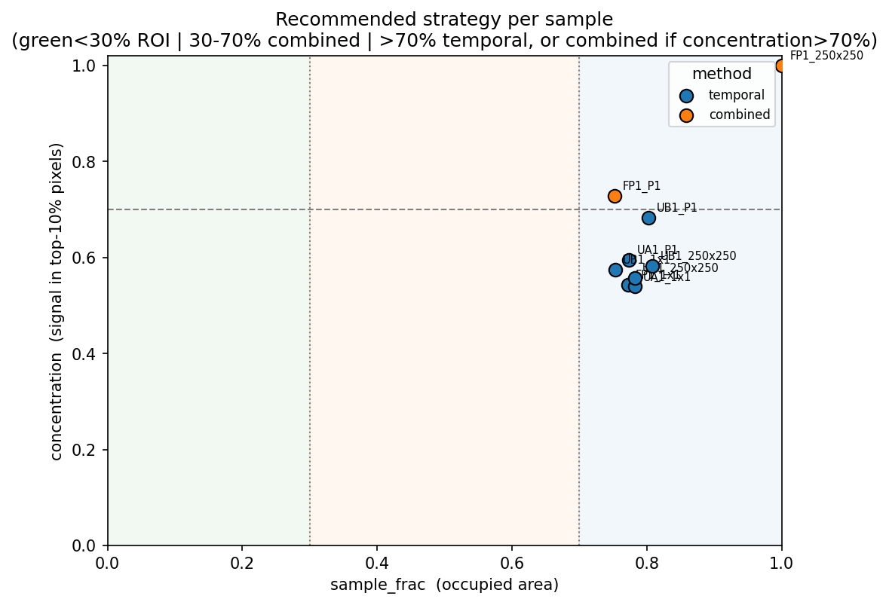
*Every sample falls in the dense band (x > 0.70), so the recommender picks
temporal or combined. None of our samples is spatially sparse on the composite,
which is exactly why spatial speedup is capped here.*

### 12.2 Per-element sparsity, the headline finding (script 11)
Each bar is one element's **bright-pixel fraction** (fraction of pixels above the
matrix level). The red dashed line is the **composite** presence (`sample_frac`).
The gap between them is the whole point: the composite is dense, but each element
lives in a small fraction of pixels.

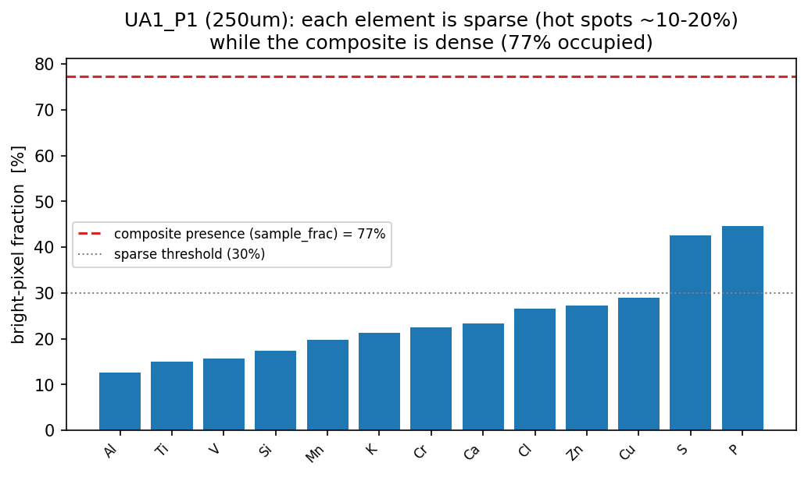
*UA1_P1: composite is 77 % occupied, yet most elements (Al ~13 %, Ti ~15 %,
V ~16 %) sit in well under 20 % of pixels, i.e. they are individually sparse.*

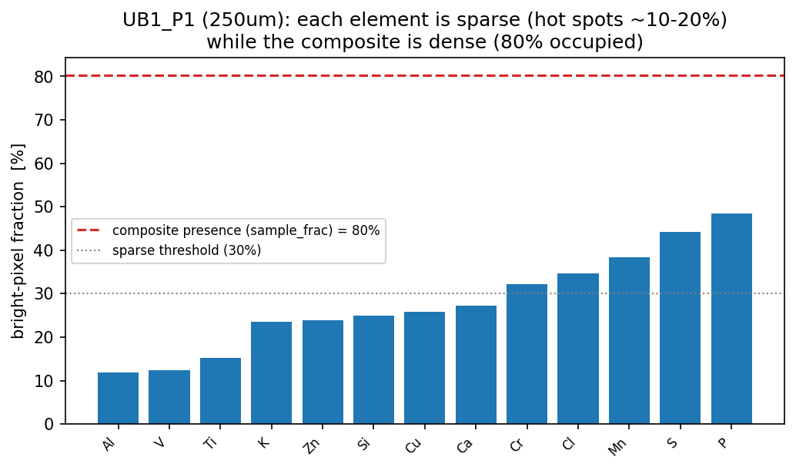
*UB1_P1: composite 80 % occupied; elements such as Al ~12 %, V ~12 %, Ti ~15 %
are sparse hot spots.*

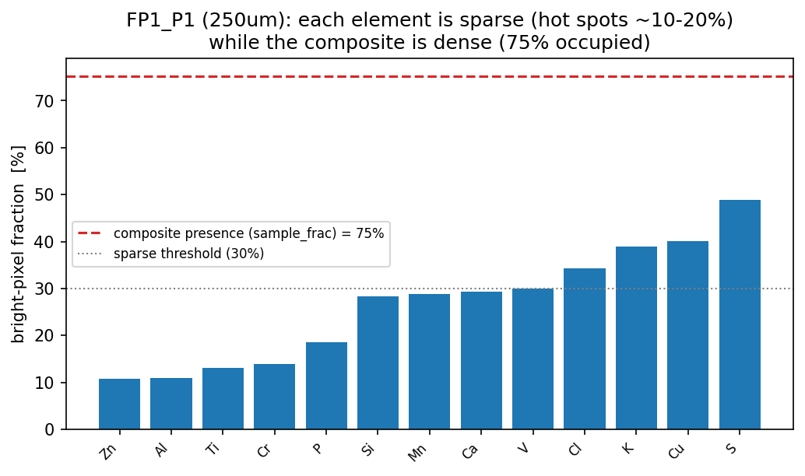
*FP1_P1: composite 75 % occupied; Zn ~11 %, Al ~11 %, Ti ~13 %, Cr ~14 %. The
single-element sparsity is the regime where adaptive scanning should win.*

### 12.3 Naive coarse-ROI baseline = the PROBLEM (script 03)
**This is the baseline that motivates the rest of the pipeline, not a final
result.** ROIs are detected on the coarse 250 µm composite, then checked against
the fine ground truth. Three panels, left to right:
**(left)** fine scan with the detected coarse ROIs as cyan boxes;
**(middle)** the "adaptive view", i.e. only the pixels that would be scanned;
**(right)** the **missed signal**, the bright points that fall outside the boxes.
The large missed fraction is **subpixel averaging**: a 25 µm particle is diluted
~100:1 in its 250 µm coarse pixel, so it does not stand out and is not detected.
The footprint, temporal and per-element methods (below / earlier) are what fix this.

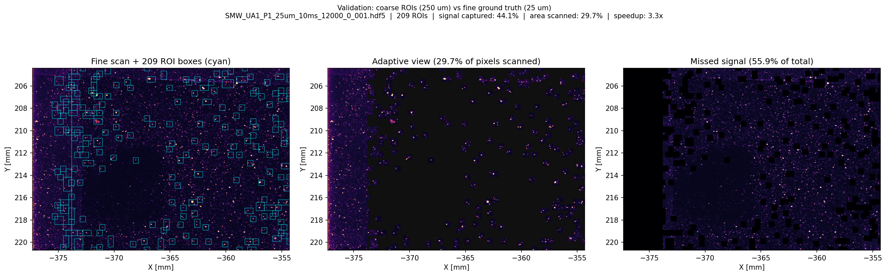
*UA1_P1: 209 ROIs, 29.7 % of pixels scanned, only 44 % of the signal captured
(56 % missed). The right panel shows the missed fine particles scattered between
the boxes. Diffuse sample, worst case for coarse ROI.*

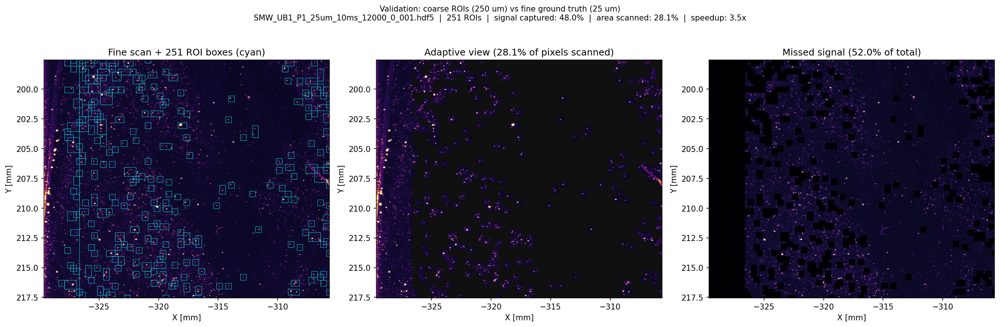
*UB1_P1: 251 ROIs, 28 % scanned, 48 % captured (52 % missed). Same story as UA1.*

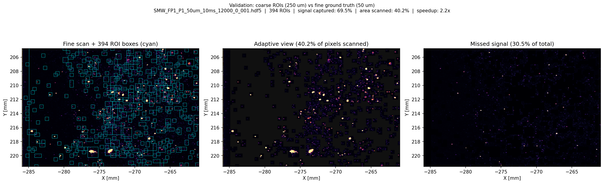
*FP1_P1: 394 ROIs, 40 % scanned, 70 % captured (30 % missed). Misses less because
the signal is more concentrated (73 %) and the fine grid is 50 µm (less dilution).*

### 12.4 Scan trajectory (script 02)
The order in which the scanner visits the regions, built with a nearest-neighbour
tour then 2-opt. Lines are the stage path between region centres.

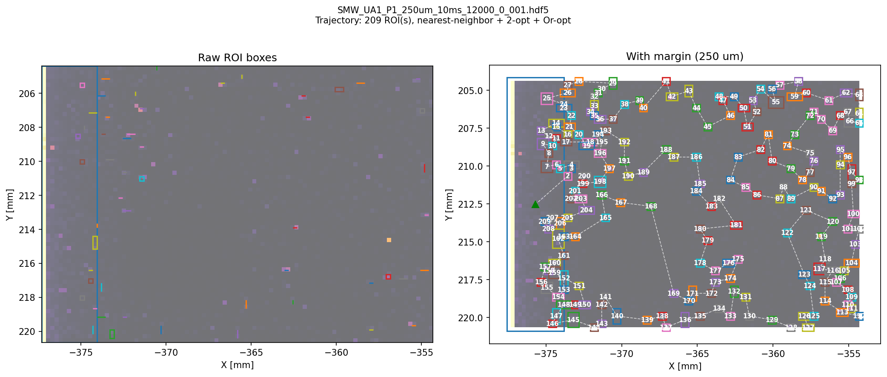
*UA1_P1: optimised tour over the ROI regions. Path length matters little here:
travel is <1 % of total scan time (dwell dominates), so this is a minor lever.*

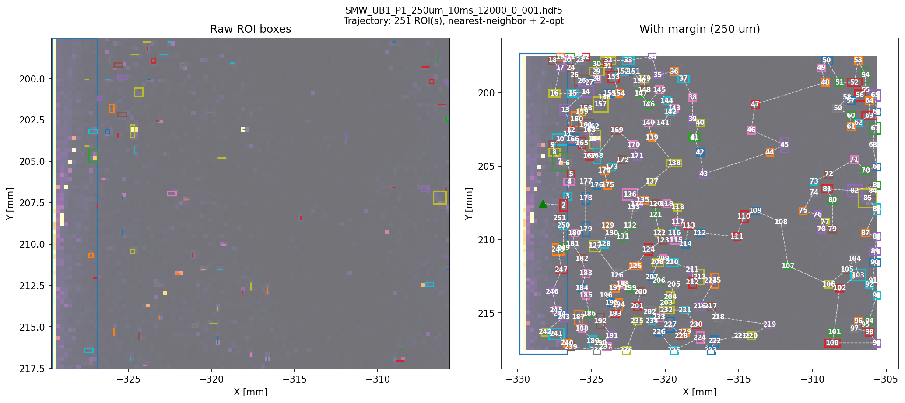
*UB1_P1: same, travel negligible vs dwell.*

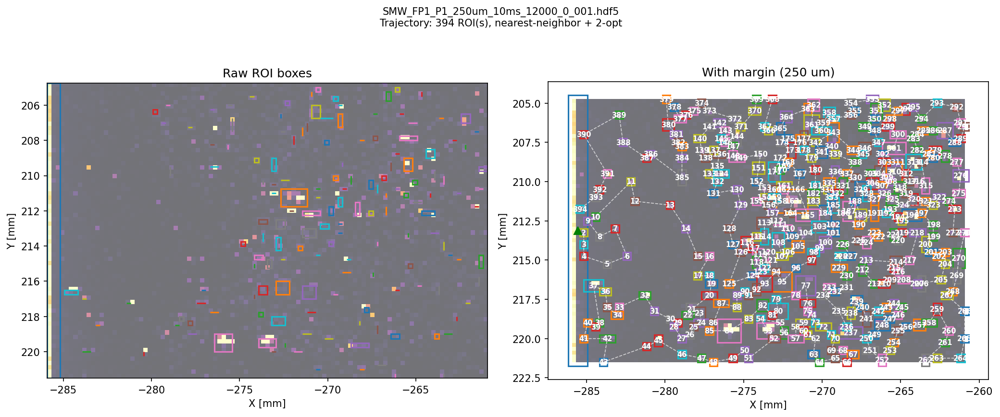
*FP1_P1: same.*

### 12.5 Hierarchical cascade (script 05)
One panel per resolution level (250 to 25 µm). The cyan contour is the sample
footprint at that level; each level only scans inside the previous mask, so the
mask should tighten as resolution improves. The last panel is the final ROIs.

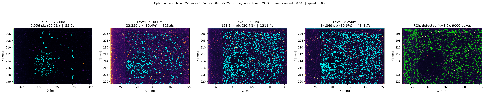
*UA1_P1: footprint barely shrinks (90.5 % to 80.6 % over the four levels) and
captures 79 % of the signal, but the cascade ends up ~as slow as a direct fine
raster on this dense sample. Refinement only helps when the mask actually tightens.*

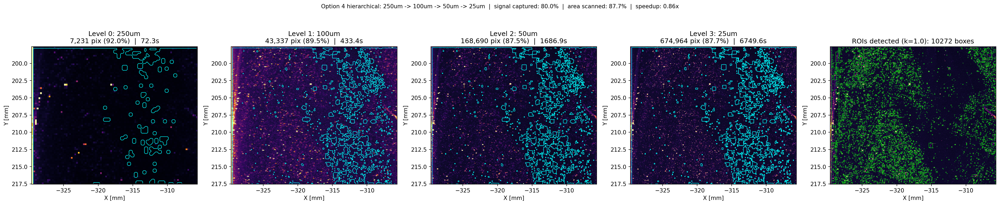
*UB1_P1: same behaviour, dense footprint, little spatial gain.*

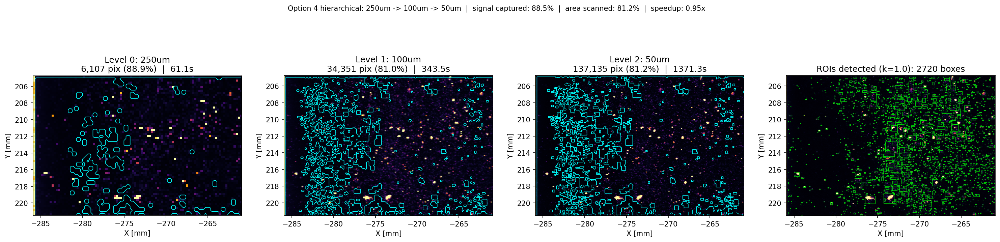
*FP1_P1: cascade 250 to 50 µm (no 25 µm scan for P1).*

### 12.6 Production scan plan (script 10, simulate)
The actual pipeline output. **(left)** coarse composite with the sample footprint
(cyan contour) and the scan regions (lime boxes); **(right)** the per-pixel
**dwell map** allocated inside the footprint (brighter = longer dwell).

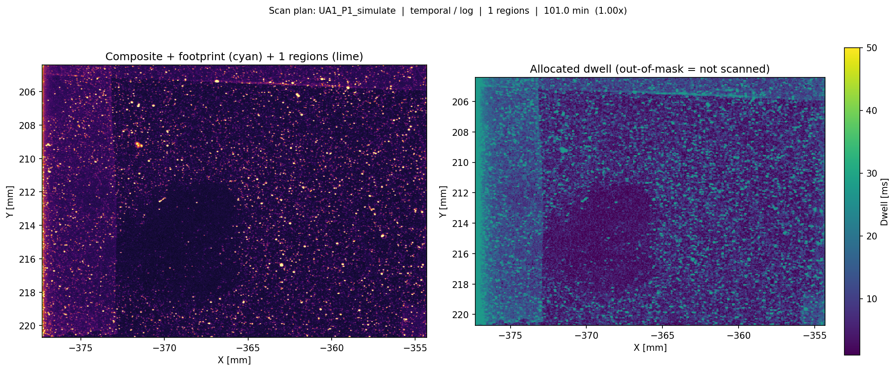
*UA1_P1: recommender picks temporal/log, so the footprint is the full frame and
the dwell map concentrates time on the bright pixels (equal-time quality play,
not a speed play).*

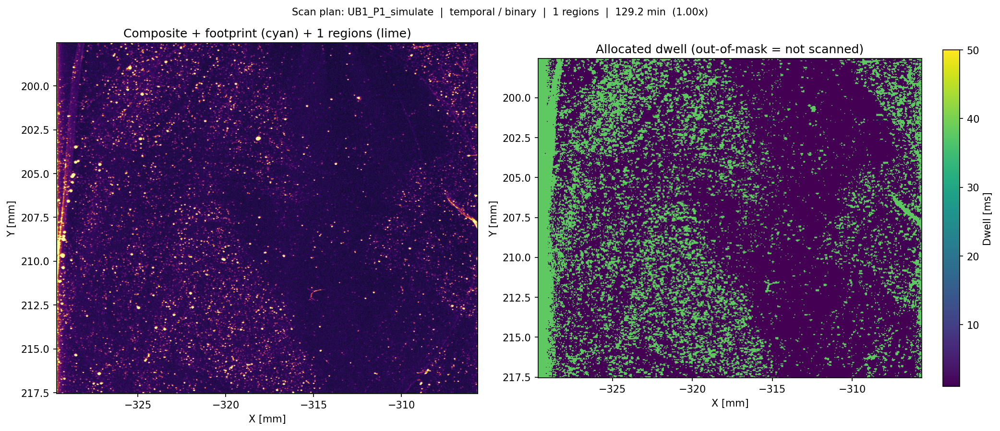
*UB1_P1: also temporal, dwell concentrated on the brightest regions.*

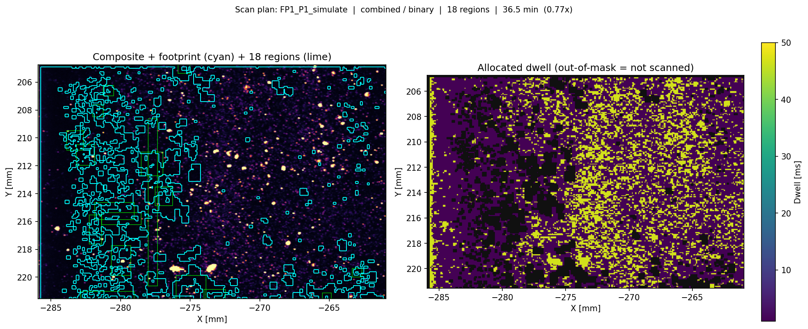
*FP1_P1: recommender picks combined (dense but concentrated), so the plan keeps a
spatial footprint plus a variable dwell inside it.*

*End of report (v2).*
